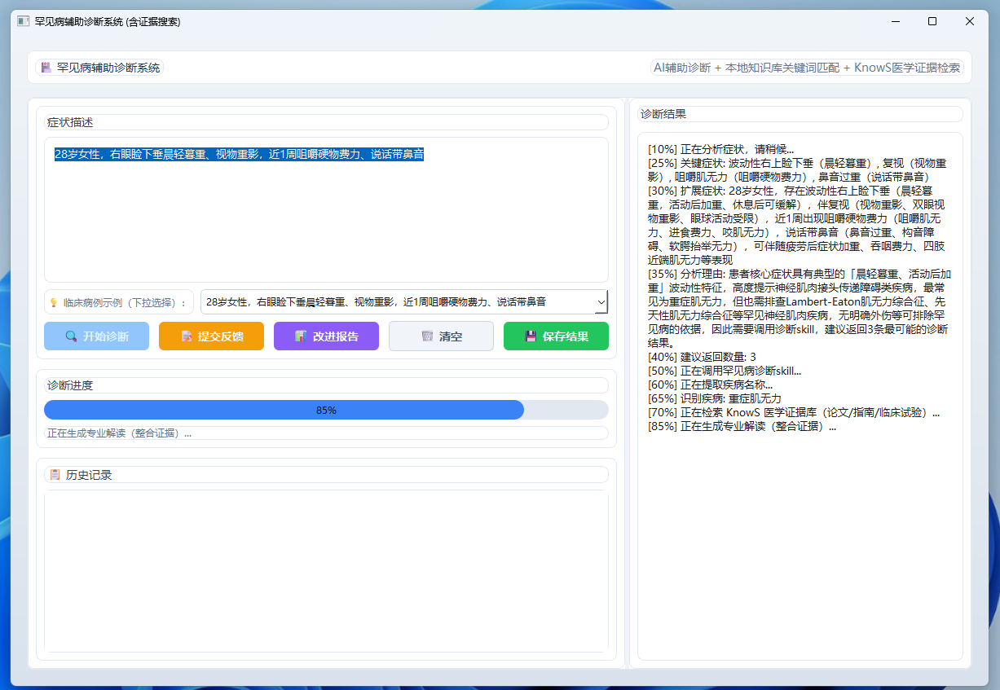

# 罕见病辅助诊断系统

## 1. 项目简介与医疗场景

- 一句话描述：用于医生和患者对罕见病的初步诊断
- 解决的痛点：罕见病诊断效率不高，提高医生的诊断效率和准确率
- 目标受众：医生、患者、医学研究员等

## 2. 功能特性

- 特性 ：支持基于KnowS 的提供医学循证证据检索

## 3. 魔搭社区运行/部署指南

- 魔搭展示链接：[Skill 详情  rare-disease-diagnosis](https://modelscope.cn/skills/xiaopch/rare-disease-diagnosis/)
- 本地运行步骤：

```bash
pip install -r requirements.txt
python app.py
```

## 4. 演示与输入输出示例

- 输入示例：`28岁女性，右眼睑下垂晨轻暮重、视物重影，近1周咀嚼硬物费力、说话带鼻音`

- 预期输出：

- 
  
  

## 5. 局限性与未来规划

- 目前版本正在完善中，技能输出仅供学习和辅助参考，**不构成任何医疗诊断依据**。如有健康疑虑，请及时前往正规医疗机构就诊。
- 未来准备加入诊断数据的输入和本地知识库的完善

## 6. 团队与致谢

- 队长：Xiaopch​ 技术/专业背景
- 成员：Liang Fang ​ 技术/专业背景
- 成员：Li YuLei 遗传病研究专家
- 致谢：魔搭开源社区的skill平台，阶跃星辰 StepFun提供的免费算力，KnowS提供医学循证证据检索
